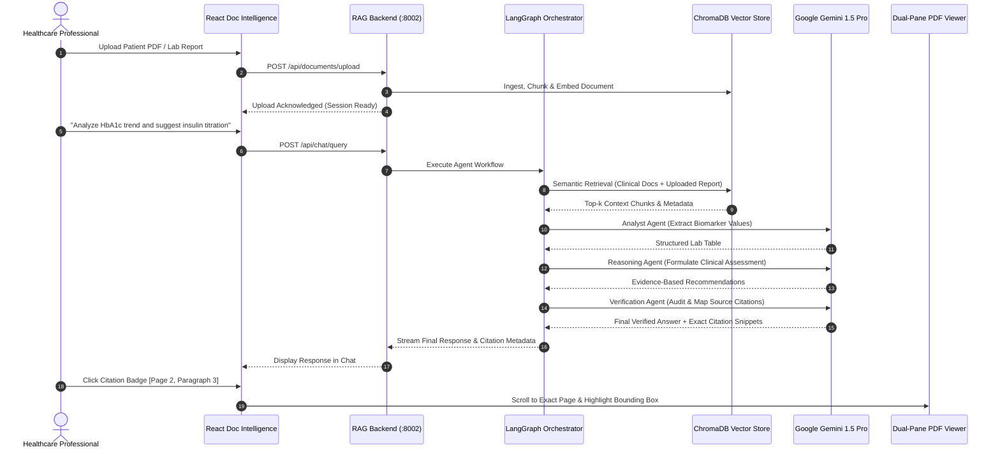
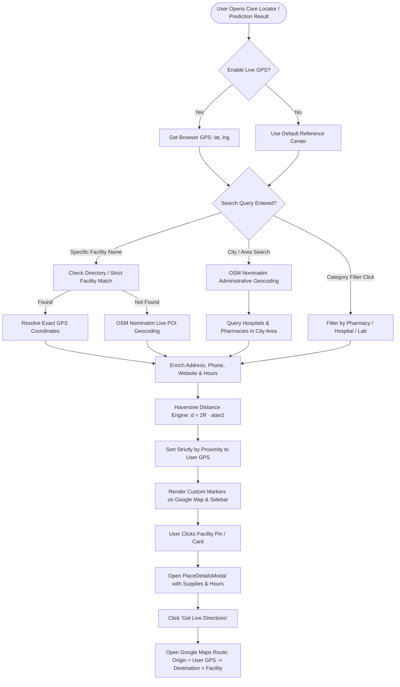

<div align="center">

 feat/frontend-ui-updates
# 🩺 MediStore AI — Clinical Diabetic Intelligence & Care Platform
=======
#  MediStore AI — Clinical Diabetic Intelligence & Care Platform


**An Enterprise-Grade Healthcare AI Ecosystem for Diabetes Risk Assessment, Complication Prediction, Multi-Agent Clinical Document Intelligence & Live Care Routing**

[](https://python.org)
[](https://fastapi.tiangolo.com)
[](https://react.dev)
[](https://vitejs.dev)
[](https://langchain.com)
[](https://trychroma.com)
[](https://developers.google.com/maps)
[](https://scikit-learn.org)
[](https://xgboost.readthedocs.io)

</div>

---

## 📖 Table of Contents

- [🚀 Platform Overview](#-platform-overview)
- [🏛️ System Architecture](#️-system-architecture)
- [🧩 Core Modules](#-core-modules)
  - [1. Primary Diabetes Risk Predictor (Model v2)](#1-primary-diabetes-risk-predictor-model-v2)
  - [2. 30-Day Complication & Readmission Risk Predictor (Model v3)](#2-30-day-complication--readmission-risk-predictor-model-v3)
  - [3. Multi-Agent Clinical Document Intelligence & RAG](#3-multi-agent-clinical-document-intelligence--rag)
  - [4. Care & Diabetic Supply Network Locator](#4-care--diabetic-supply-network-locator)
- [🔄 Multi-Agent & RAG Workflow](#-multi-agent--rag-workflow)
- [🗺️ Care Locator & GPS Proximity Engine](#️-care-locator--gps-proximity-engine)
- [📁 Repository Structure](#-repository-structure)
- [🌐 API Endpoints Reference](#-api-endpoints-reference)
- [💻 Quick Start & Setup Guide](#-quick-start--setup-guide)
  - [Prerequisites](#prerequisites)
  - [One-Click Startup (Recommended)](#one-click-startup-recommended)
  - [Manual Service Startup](#manual-service-startup)
  - [Docker Compose Deployment](#docker-compose-deployment)
- [⚙️ Environment Configuration](#️-environment-configuration)
- [🔬 Model Retraining & Verification](#-model-retraining--verification)
- [⚠️ Medical Disclaimer](#️-medical-disclaimer)

---

## 🚀 Platform Overview

**MediStore AI** is a comprehensive, clinical-grade medical intelligence platform designed to empower healthcare professionals, pharmacists, and patients across four essential pillars of diabetic management:

1. **Biomarker Risk Stratification**: Early detection of diabetes risk using advanced machine learning ensembles with 16 clinical biomarker indicators.
2. **Inpatient Complication Risk Forecasting**: Prediction of 30-day hospital readmissions and cardiometabolic complications derived from over 101,000 patient records.
3. **Multi-Agent Document Intelligence**: LangGraph-orchestrated multi-agent conversational RAG engine that analyzes clinical records, lab reports, and diabetic literature with exact source citation highlighting.
4. **Live Care & Diabetic Supply Network**: Interactive medical GIS locator connecting patients to nearby 24/7 hospitals, certified cold-chain pharmacies, endocrinologists, and HbA1c diagnostic laboratories with exact GPS distance calculations and 1-click turn-by-turn navigation.

---

## 🏛️ System Architecture

MediStore AI employs a modular microservice architecture combining a high-performance **React + Vite** frontend, **three dedicated FastAPI backend services**, an **asynchronous LangGraph multi-agent pipeline**, and a **hybrid GIS geocoding engine**.

```mermaid
graph TB
    classDef client fill:#0f172a,stroke:#38bdf8,stroke-width:2px,color:#f8fafc;
    classDef v2API fill:#064e3b,stroke:#34d399,stroke-width:2px,color:#f8fafc;
    classDef v3API fill:#1e1b4b,stroke:#818cf8,stroke-width:2px,color:#f8fafc;
    classDef ragAPI fill:#701a75,stroke:#f472b6,stroke-width:2px,color:#f8fafc;
    classDef agent fill:#3b0764,stroke:#c084fc,stroke-width:2px,color:#f8fafc;
    classDef store fill:#1c1917,stroke:#fbbf24,stroke-width:2px,color:#f8fafc;
    classDef external fill:#1e293b,stroke:#94a3b8,stroke-width:2px,color:#f8fafc;

    subgraph ClientLayer ["🖥️ Frontend Client Layer (React 18 + Vite · Port 5173)"]
        UI_Mode["Mode Selection Hub"]:::client
        UI_V2["Diabetes Risk Predictor Screen"]:::client
        UI_V3["Complication Predictor Screen"]:::client
        UI_RAG["Doc Intelligence Screen (Chat + PDF Viewer)"]:::client
        UI_Map["Care & Supply Locator (Interactive Map)"]:::client
    end

    subgraph Backend_V2 ["⚙️ v2 Backend Service (Port 8000)"]
        V2_Predict["POST /predict (PIMA Model)"]:::v2API
        V2_Nearby["GET /api/places/nearby"]:::v2API
        V2_Search["GET /api/places/search"]:::v2API
        V2_Engine["16-Feature ML Pipeline & SHAP"]:::v2API
        Places_Service["Places & Distance Engine"]:::v2API
    end

    subgraph Backend_V3 ["⚙️ v3 Backend Service (Port 8001)"]
        V3_Predict["POST /predict_v3 (UCI-130 Model)"]:::v3API
        V3_Engine["Soft-Voting Ensemble (XGB+LGBM+RF) & SHAP"]:::v3API
    end

    subgraph Backend_RAG ["⚙️ Multi-Agent RAG Backend (Port 8002)"]
        RAG_Upload["POST /api/documents/upload"]:::ragAPI
        RAG_Query["POST /api/chat/query (Streaming/Async)"]:::ragAPI
        RAG_Sessions["Session & Context Manager"]:::ragAPI
        
        subgraph LangGraph_Engine ["🤖 LangGraph Multi-Agent Orchestration"]
            Agent_Orch["Orchestrator Agent"]:::agent
            Agent_Reason["Medical Reasoning Agent"]:::agent
            Agent_Analyst["Clinical Data Analyst Agent"]:::agent
            Agent_Verify["Citation Verification Agent"]:::agent
        end
    end

    subgraph DataStores ["💾 Data Stores & Storage"]
        Chroma_Static[("ChromaDB Static Corpus")]:::store
        Chroma_Session[("ChromaDB Session VectorDB")]:::store
        Disk_Uploads[("Uploaded PDF Vault")]:::store
        ML_Artifacts[("Trained .pkl Models & Scalers")]:::store
    end

    subgraph External_Services ["🌐 External Services & APIs"]
        Gemini_API["Google Gemini LLM"]:::external
        OSM_Nominatim["OpenStreetMap Nominatim"]:::external
        Google_Maps_API["Google Maps Platform API"]:::external
    end

    %% Client to Backend Routes
    UI_V2 -->|"Predict Request"| V2_Predict
    UI_Map -->|"Proximity & Search"| V2_Nearby & V2_Search
    UI_V3 -->|"Complication Request"| V3_Predict
    UI_RAG -->|"Upload PDF"| RAG_Upload
    UI_RAG -->|"Query Stream"| RAG_Query

    %% V2 Internal
    V2_Predict --> V2_Engine --> ML_Artifacts
    V2_Nearby & V2_Search --> Places_Service
    Places_Service --> OSM_Nominatim & Google_Maps_API

    %% V3 Internal
    V3_Predict --> V3_Engine --> ML_Artifacts

    %% RAG Internal
    RAG_Upload --> Disk_Uploads
    RAG_Upload --> Chroma_Session
    RAG_Query --> LangGraph_Engine
    LangGraph_Engine --> Agent_Orch
    Agent_Orch --> Agent_Reason & Agent_Analyst
    Agent_Reason & Agent_Analyst --> Agent_Verify
    Agent_Verify --> RAG_Sessions
    LangGraph_Engine --> Chroma_Static & Chroma_Session
    LangGraph_Engine --> Gemini_API
```



---

## 🧩 Core Modules

### 1. Primary Diabetes Risk Predictor (Model v2)
- **Clinical Dataset:** PIMA Indian Diabetes Dataset with SMOTE balancing.
- **Engineered Biomarkers (16 Features):**
  - *Base:* Pregnancies, Glucose, Blood Pressure, Skin Thickness, Insulin, BMI, Diabetes Pedigree Function, Age.
  - *Engineered:* `Glucose_BMI_Ratio`, `Insulin_Resistance`, `Age_BMI_Interaction`, `BP_Age_Risk`, `Glucose_Category`, `BMI_Category`, `Age_Category`, `Metabolic_Syndrome_Risk`.
- **Model:** High-precision XGBoost Ensemble (~85%+ accuracy).
- **Explainability:** Real-time SHAP force/waterfall plot generation as base64 images explaining exact biomarker contributions.

### 2. 30-Day Complication & Readmission Risk Predictor (Model v3)
- **Clinical Dataset:** UCI Diabetes 130-US Hospitals (101,767 real patient records).
- **Target Outcome:** Binary classification of 30-day early hospital readmission risk.
- **Ensemble Architecture:** Soft-Voting Ensemble combining **XGBoost (weight: 2)**, **LightGBM (weight: 2)**, and **Random Forest (weight: 1)**.
- **Clinical Factors:** Primary ICD-9 diagnosis clusters, admission/discharge sources, max glucose serum, A1C results, inpatient duration, and 23 diabetic medication change flags.

### 3. Multi-Agent Clinical Document Intelligence & RAG
- **Agent Orchestration:** Asynchronous multi-agent state graph built on **LangGraph**.
- **Specialized Clinical Agents:**
  - `Orchestrator Agent`: Evaluates intent, decomposes queries, and delegates sub-tasks.
  - `Medical Reasoning Agent`: Synthesizes diabetic pathology, pathophysiology, and clinical guidelines.
  - `Clinical Data Analyst Agent`: Extracts, tabulates, and analyzes biomarker values and lab panels from medical PDFs.
  - `Citation Verification Agent`: Verifies claims against vector chunks, generating page/paragraph citations.
- **Interactive UI Integration:** Dual-pane document viewer with side-by-side synchronized citation navigation and interactive source jumping.

### 4. Care & Diabetic Supply Network Locator
- **Live GPS Proximity Engine:** Computes exact Haversine great-circle distances relative to the user's live browser location.
- **Hybrid Geocoding:** Real-time worldwide geocoding through OpenStreetMap Nominatim and Google Places Text Search.
- **Facility Categorization:**
  - 🚨 *24/7 Emergency Multispecialty Hospitals* (DKA, ICU, Resuscitation)
  - 💊 *Certified Pharmacies & Cold-Chain Hubs* (Insulin Glargine/Aspart, CGM Sensors, Test Strips)
  - 🩺 *Endocrinology & Diabetic Specialty Clinics*
  - 🧪 *HbA1c Diagnostic Reference Laboratories*
  - 🦶 *Diabetic Podiatry & Wound Care Centers*
- **1-Click Turn-by-Turn Navigation:** Direct dynamic Google Maps navigation link from active user GPS coordinates to destination.
- **Post-Predictor Care Routing:** Automatic smart recommendation of care centers directly from prediction results based on risk severity.

---

## 🔄 Multi-Agent & RAG Workflow



---

## 🗺️ Care Locator & GPS Proximity Engine



---

## 📁 Repository Structure

```
MediStore-Diabetes-Prediction-AI/
├── apps/
│   └── streamlit/
│       └── app.py                     # Legacy Streamlit Web Application
├── backend/
│   ├── api/
│   │   ├── places_service.py          # Geocoding, POI resolution & distance engine
│   │   ├── v2_server.py               # FastAPI Service · Diabetes Risk Predictor (Port 8000)
│   │   └── v3_server.py               # FastAPI Service · Complication Risk Predictor (Port 8001)
│   ├── app/
│   │   ├── agents/                    # LangGraph multi-agent node implementations
│   │   │   ├── analyst.py             # Clinical data analyst agent
│   │   │   ├── orchestrator.py        # Master intent & delegation agent
│   │   │   ├── reasoning.py           # Medical guideline reasoning agent
│   │   │   └── verifier.py            # Citation verification agent
│   │   ├── graph.py                   # LangGraph workflow definition & state machine
│   │   └── main.py                    # Multi-agent app factory
│   ├── config.py                      # Global path configuration & artifact registry
│   ├── data_ingestion/                # ChromaDB vector embedding & document indexing
│   ├── ml/
│   │   ├── model_runner.py            # Unified ML inference wrapper
│   │   ├── preprocessing_uci130.py    # UCI-130 feature pipeline & encoder
│   │   ├── train_v2.py                # PIMA XGBoost model training script
│   │   ├── train_v3.py                # UCI-130 Soft-Voting ensemble training script
│   │   └── verify_v3.py               # Model artifact integrity verification
│   ├── rag/                           # Retrieval-Augmented Generation core modules
│   │   ├── prompts.py                 # Clinical system prompts & few-shot templates
│   │   └── session_store.py           # Multi-session memory store
│   └── rag_main.py                    # FastAPI Service · Multi-Agent RAG Backend (Port 8002)
├── data/
│   ├── raw/                           # Raw medical datasets (diabetes.csv, diabetic_data.csv)
│   └── raw_docs/                      # Clinical guideline PDFs & diabetes reference corpus
├── docs/
│   └── GOOGLE_MAPS_CARE_LOCATOR_GUIDE.md # Technical implementation guide for Care Locator
├── frontend/
│   ├── src/
│   │   ├── api/
│   │   │   ├── api.js                 # Axios client for v2 & v3 prediction backends
│   │   │   └── docApi.js              # Axios client for multi-agent RAG backend
│   │   ├── components/
│   │   │   ├── CitationPanel/         # Interactive citation side-drawer
│   │   │   ├── DocChat/               # Conversational multi-agent chat interface
│   │   │   ├── DocUpload/             # Drag-and-drop clinical PDF uploader
│   │   │   ├── DocViewer/             # Dual-pane PDF renderer with highlight overlays
│   │   │   ├── maps/
│   │   │   │   ├── CareMap.css        # Clinical dark-mode map & drawer styles
│   │   │   │   ├── CareMap.jsx        # Google Maps integration & marker manager
│   │   │   │   ├── MapFilterBar.jsx   # Facility category switcher & GPS toggle
│   │   │   │   ├── PlaceDetailsModal.jsx # Detail drawer with supplies & navigation
│   │   │   │   └── mapStyles.js       # Custom dark medical Google Maps theme
│   │   │   ├── results/
│   │   │   │   └── ResultDashboard.jsx# Risk dashboard with SHAP plots & care routing
│   │   │   └── ui/                    # Reusable atomic UI components (TopBar, Buttons, etc.)
│   │   ├── screens/
│   │   │   ├── CareLocator.jsx        # Full-screen Care & Supply Network view
│   │   │   ├── ComplicationPredictor.jsx # 30-Day readmission prediction screen
│   │   │   ├── DiabetesPredictor.jsx  # Primary diabetes prediction screen
│   │   │   ├── DocIntelligence.jsx    # Clinical document intelligence workspace
│   │   │   └── ModeSelect.jsx         # Main platform navigation hub
│   │   ├── App.jsx                    # Root view controller & navigation routing
│   │   ├── index.css                  # Global design system & theme tokens
│   │   └── main.jsx                   # React DOM entry point
│   ├── package.json                   # Frontend dependencies & scripts
│   └── vite.config.js                 # Vite build configuration
├── mcp_servers/
│   └── document_mcp/
│       └── server.py                  # Model Context Protocol (MCP) document server
├── models/
│   ├── v2/                            # Trained PIMA XGBoost model, scaler & feature JSON
│   └── v3/                            # Trained UCI-130 Ensemble model, scaler & feature JSON
├── notebooks/                         # Jupyter research notebooks (EDA, feature engineering)
├── reports/figures/                   # Generated SHAP feature importance plots & charts
├── scripts/
│   └── start.ps1                      # Automated Windows multi-service launcher script
├── docker-compose.yml                 # Multi-container production deployment config
├── Dockerfile                         # Container specification
├── requirements.txt                   # Base Python dependencies
├── requirements_rag.txt               # Multi-agent RAG & LangGraph dependencies
└── requirements_uci130.txt            # Model v3 ML dependencies
```

---

## 🌐 API Endpoints Reference

### 1. v2 Service — Diabetes Risk & Places API (`http://localhost:8000`)

| Method | Endpoint | Description |
| :--- | :--- | :--- |
| `POST` | `/predict` | Predicts diabetes risk probability from 8 patient biomarkers with SHAP plot |
| `GET` | `/api/places/nearby` | Fetches nearby facilities filtered by category, sorted by exact Haversine distance |
| `GET` | `/api/places/search` | Performs live search across facilities/cities with exact GPS distance calculation |
| `GET` | `/health` | Healthcheck endpoint for service status |

### 2. v3 Service — Complication Risk API (`http://localhost:8001`)

| Method | Endpoint | Description |
| :--- | :--- | :--- |
| `POST` | `/predict_v3` | Predicts 30-day early hospital readmission risk using UCI-130 ensemble |
| `GET` | `/health` | Healthcheck endpoint for service status |

### 3. RAG Service — Clinical Document Intelligence API (`http://localhost:8002`)

| Method | Endpoint | Description |
| :--- | :--- | :--- |
| `POST` | `/api/documents/upload` | Ingests and embeds a patient PDF into the active session vector store |
| `POST` | `/api/chat/query` | Executes LangGraph multi-agent reasoning, returning response with citations |
| `GET` | `/api/sessions/{id}` | Retrieves session message history and active document metadata |
| `DELETE`| `/api/sessions/{id}` | Purges session vector cache and temporary documents |

---

## 💻 Quick Start & Setup Guide

### Prerequisites
- **Python:** 3.10 or 3.11
- **Node.js:** 18.x or 20.x (with `npm`)
- **Google Gemini API Key:** For multi-agent LLM reasoning
- **Google Maps API Key (Optional):** For Google Maps JS canvas rendering (OpenStreetMap works out-of-the-box)

---

### One-Click Startup (Recommended)

Run the automated startup script in PowerShell from the project root:

```powershell
.\scripts\start.ps1
```

This starts all four services in dedicated terminal windows:
- 🟢 **Frontend UI**: `http://localhost:5173`
- 🟢 **v2 Backend (Diabetes & Care Locator)**: `http://localhost:8000`
- 🟢 **v3 Backend (Complication Risk)**: `http://localhost:8001`
- 🟢 **RAG Backend (Document Intelligence)**: `http://localhost:8002`

---

### Manual Service Startup

#### 1. Python Environment Setup
```bash
# Windows
python -m venv venv
.\venv\Scripts\activate

# macOS / Linux
# python3 -m venv venv
# source venv/bin/activate

# Install all requirements
pip install -r requirements.txt
pip install -r requirements_uci130.txt
pip install -r requirements_rag.txt
```

#### 2. Start the Backend Services (Separate Terminals)
```bash
# Terminal 1 — v2 Predictor & Care Locator API
uvicorn backend.api.v2_server:app --reload --port 8000

# Terminal 2 — v3 Complication Predictor API
uvicorn backend.api.v3_server:app --reload --port 8001

# Terminal 3 — Multi-Agent Document Intelligence API
uvicorn backend.rag_main:app --reload --port 8002
```

#### 3. Start the React Frontend
```bash
cd frontend
npm install
npm run dev
```

Open **`http://localhost:5173`** in your browser.

---

### Docker Compose Deployment

```bash
docker-compose up --build
```

---

## ⚙️ Environment Configuration

Create a `.env` file in the project root based on `.env.example`:

```env
# Gemini API Key (Required for Multi-Agent RAG)
GOOGLE_API_KEY=your_gemini_api_key_here

# Google Maps API Key (Optional for live Maps rendering)
GOOGLE_MAPS_API_KEY=your_google_maps_api_key_here
VITE_GOOGLE_MAPS_API_KEY=your_google_maps_api_key_here

# Backend Service URLs (Defaults)
VITE_API_V2_URL=http://localhost:8000
VITE_API_V3_URL=http://localhost:8001
VITE_API_RAG_URL=http://localhost:8002
```

---

## 🔬 Model Retraining & Verification

You can retrain both predictive machine learning models at any time using the standalone training modules:

```bash
# 1. Retrain v2 Diabetes Risk Predictor (PIMA)
python -m backend.ml.train_v2

# 2. Retrain v3 Complication Predictor (UCI-130)
python -m backend.ml.train_v3

# 3. Verify Model Artifacts & Test Inferences
python -m backend.ml.verify_v3
```

All trained `.pkl` artifacts and feature definitions are saved directly to `models/v2/` and `models/v3/`.

---

## ⚠️ Medical Disclaimer

> **IMPORTANT NOTICE**  
> *This software is designed as a clinical decision support and educational research platform. It does not provide definitive medical diagnoses, treatment prescriptions, or emergency triage advice. All predictions, risk evaluations, and AI reasoning outputs should always be independently reviewed and verified by a licensed medical practitioner.*

---

<div align="center">
  <sub>Built with  by the MediStore AI Engineering Team · Clinical Intelligence for Better Health Outcomes</sub>
=======
  <sub> MediStore AI Engineering </sub>

</div>
